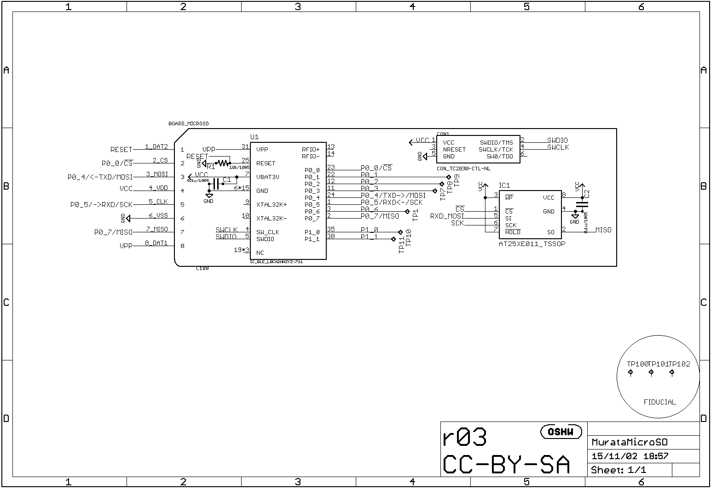

# ぼくがかんがえたさいきょうのry
## NXP社LPC11U35とマイクロSDカードでイカ醤油*もどき*する
### ハードウェア構想
ハードウェア構成は以下のようなものを考えます：

- `DA14580`のチップまたはモジュール
    - 可能ならば技適取得済かつDigikeyなどで購入可能なもの
- SPIフラッシュメモリ
- 全体の制御をするマイコン"LPC11U35"
- マイクロSDカード

以下に詳細を述べていきます。

#### DA14580(が載った技適取得済モジュール)
2015年現在、

* `DA14580`が採用されている  
* **[DigiKey](http://www.digikey.com/)や[Mouser](http://www.mouser.com/) で買える**
* アメリカからの輸出規制に引っかからない
* 日本国内で合法である(技適取得済である)

という条件を満たすBLEモジュール、あるいは評価基板は、
村田製作所製のTypeZY
という品種[^ZYmouser][^ZYdigikey] (以下`村田モジュール`と呼びます)のみです。
困ったことに **Dialog社の評価ボード^[http://www.digikey.com/product-detail/en/DA14580DEVKT-B/1564-1000-ND/5113983]
 は技適もFCC・ICも通っていません。**
ICチップについては中国でどこかが採用しているかもしれませんし、aitendoに入荷する可能性がありますが、
端的に言って違法行為なので[^1]、堂々と個人購入できる`村田モジュール`を使いましょう。

[^1]: 買うだけで違法行為と断じてしまうのは、ちょっと語弊があります。
電波を出さない限りは（Lチカをするだけなら）使っても何も問題ないのですが、
電波暗室を所有している人以外は肝心のBLEで遊べないので、
おとなしく技適済モジュールを使いましょう。
村田モジュールを1個だけ買うと14ドルもするのでよいお値段と言えますが、その価値はあると考えます。

といってもこのモジュールはとても特殊な形状で**手ハンダ不可能**[^2]です。
他社のBLEモジュールのように端面スルーホールなどではなくて裏面パッドのみ（筆者曰く「無慈悲な裏面パッド」）
なのでリフローが必須です。

[^2]: 頑張れば半田ごてリフローで実装できます。

そこで筆者がすでにオープンソースハードウェアとして[開発中](https://github.com/K4zuki/da14580)
の"村田モジュール基板"を使います。
この基板はマイクロSDカードスロットに刺せる形状になっていて、マイクロSDの端子には

* 1x リセットピン
* 1x OTP書き込みピン
* 4x GPIOピン（ホストとの通信またはフラッシュメモリへの書き込み）
* 1x SPIフラッシュメモリ([後述](#SPIフラッシュメモリ))

がつながっています。この基板にはSWDデバッグ用の”TagConnect”パッドが用意されています。
詳細は下記回路図を参照してください。

#### SPIフラッシュメモリ
`DA14580`は[前項](#DA14580のブート手順)で少し触れたように、
SPIスレーブデバイスからもブートすることができます。アプリケーションの内容を自由に書き換えられるように
SPIフラッシュメモリを用意しておきます。

#### NXP LPC11U35マイコン
mbed LPC1768はLocalFileSystem以外にもEthernetやUSBホスト/デバイスなど機能が盛り沢山で、
最初のmbedとしてはベストなのですが、多機能すぎです。
そこで、LocalFileSystemを持っていないmbedプラットフォームを用いつつ、LocalFileSystemと
同様に扱えるファイルシステムをソフト的に実装します。  
これに使えそうなマイコンとして`LPC11U35`を使うことを考えました。`LPC11U35`はUSBデバイス機能を持った
NXP社LPCシリーズのCortex-M0マイコンです。パッケージサイズも小さく、5ミリ角のQFNパッケージから
ラインナップされています。mbedインタフェースIC[^3]としてNXP系のmbedプラットフォームによく載っています。

#### マイクロSDカード
mbed.org上に上がっている各種ライブラリには、マイクロSDカードを扱うものもあります。
LocalFileSystemはmbed LPC1768/11U24に実装されているフラッシュメモリを利用していますが、
その部分のライブラリ類はMDK-ARMのフリー版ではコンパイルできないので、
マイクロSDカードで代替させる方法を考えます。

### ソフトウェア構想
ソフト面は *OTP書き込みをとりあえず諦めることにして、*

1. ホストマイコンがマイクロSDに保存されたアプリケーションバイナリをSPIフラッシュに書き込む
1. ホスト越しにマイクロSDからUARTブートプロトコルを利用してセカンダリブートローダをロードする
1. セカンダリブートローダがSPIフラッシュからアプリケーションをロードして実行

の3段階になるように実装します。

#### OTP書き込みは諦める
はい、諦めます。OTPプログラムのアルゴリズムを、*筆者が理解できていない* からです。
ソースツリーをよく読めばいいのですが。

#### DA14580用セカンダリブートローダ
`DA14580`は先述の通りOTPに何も書かれていなくてもアプリケーションをロード・実行することができます。
しかし、この時使われるピンは予約されていて変更できません。自由にピン配置を決めるために
セカンダリブートローダが用意されています。セカンダリブートローダを使用するためには次のいずれかの方法で
SRAMに書き込まなければなりません：

1. OTPに書き込む -> **不採用**
1. ハードウェアブートローダを利用してSRAMにロードする -> _こっちならなんとか_

ただし、どちらにせよ、アプリケーションバイナリは
セカンダリが実行されるより前にSPIフラッシュに書き込まれている必要があります。

#### mbed式DA14580用UARTローダライブラリ
[前2.3項](#mbedへの実装)で示したLPC1768向けのプログラムからアルゴリズムを抜き出し、
LocalFileSystemを何らかのストレージシステムで代用する前提でLPC11U35でも使えるように移植しました：
[DA14580(mbedライブラリ)][3_1_2]

#### マイクロSDカードをUSBメモリに見せる

[^ZYmouser]: http://www.mouser.com/ProductDetail/Murata-Electronics/LBCA2HNZYZ-711/?qs=sGAEpiMZZMsjLMBIknjmki7mhmsF%252bV1Dy9KZILyb4MdfrPQvuKsnIw%3d%3d

[^ZYdigikey]: http://www.digikey.com/product-detail/en/LBCA2HNZYZ-711/490-10561-1-ND/5037167
[^3]:
mbedインタフェースICはUSBメモリとしてPCに認識されるように
プログラムされていて、ドラッグ&ドロップでターゲットICに
バイナリを書き込みます。それ以外の時はUSB-UARTブリッジもしくは
CMSIS-DAPデバッグインタフェースとして振る舞います。

[3_1_1]: https://developer.mbed.org/users/MACRUM/notebook/mbed-hdk/
[3_1_2]: https://developer.mbed.org/users/k4zuki/code/DA14580/
[3_1_3]: https://developer.mbed.org/users/va009039/
[3_1_4]: https://developer.mbed.org/users/k4zuki/code/USBLocalFileSystem/
