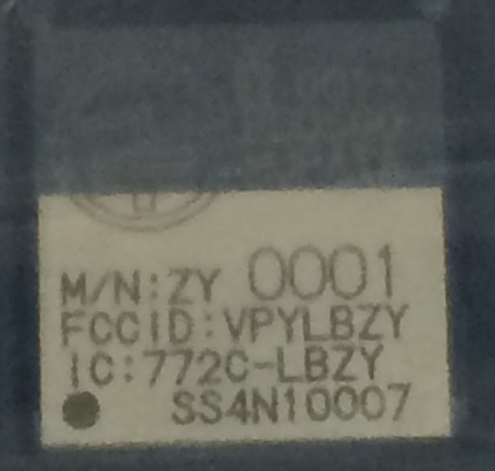
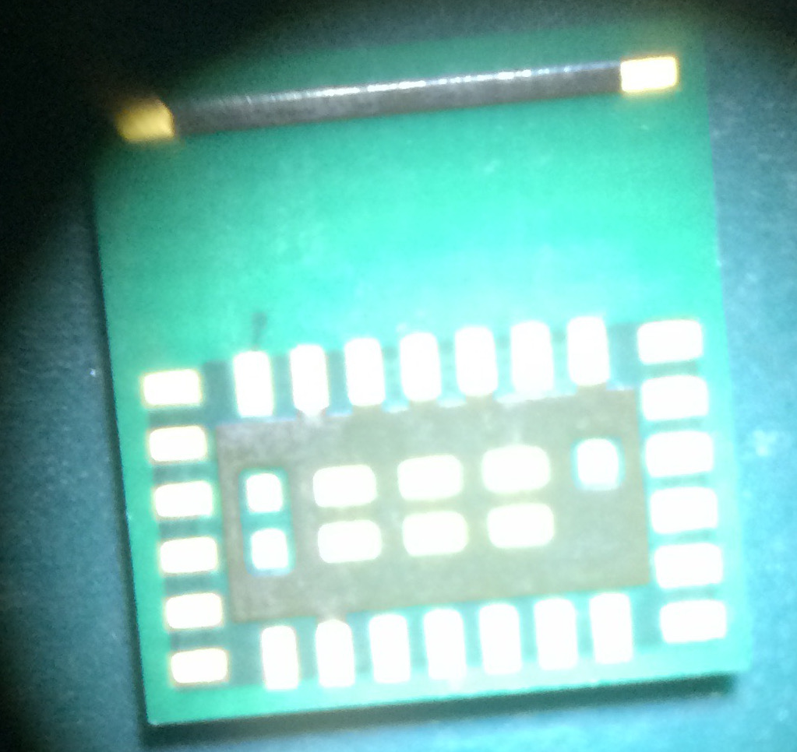

<!--
# NXP社LPC11U35とマイクロSDカードでイカ醤油*もどき*する
-->
# ぼくがかんがえたさいきょうの(ry {#sec:Mybestidea}
イカ醤油ポッポ焼きをDA14580向けに移植できたので、今度はそれをもっと

- 小さく
- 安く^[~~自分で基板作るってかえって高いんじゃない？~~]
- mbedを使って

実装することを考えます^[~~車輪の再発明かな？~~]。

## ハードウェア構想
ハードウェア構成は以下のようなものを考えます：

- `DA14580`のチップまたはモジュール
    - 可能ならば技適取得済かつDigikeyなどで購入可能なもの
- SPIフラッシュメモリ
- 全体の制御をするARMマイコン"LPC11U35"
- マイクロSDカード
- SWDデバッグコネクタ
- 書き込みトリガ用押しボタン

以下に詳細を述べていきます。

### DA14580(が載った技適取得済モジュール)
早速DA14580またはモジュールを入手します。ICについては、日本にも代理店があるのですが、
少量購入に対する反応が非常に遅いだろうというのは想像に難くありません。また、
困ったことに**Dialog社の評価ボード^[http://www.digikey.com/product-detail/en/DA14580DEVKT-B/1564-1000-ND/5113983]
は技適もFCC・ICも通っていません**ので、モジュールの購入を考えます。どうせモジュール
を買うなら技適の心配をしたくないのでとりあえず中華製はやめときます[^notmadeinchina]。
技適を通ったモジュールならきっと代理店があるでしょうが少量購入に対す(ry\
ので、入手方法はDigikeyまたはMouserでの購入に限定します。

[^notmadeinchina]: やめとくというか、手を出したことがありません。\
http://ja.aliexpress.com/wholesale?catId=0&initiative_id=SB_20151111095328&origin=y&SearchText=da14580\
あたりに中華製モジュールがいっぱい出てます。

さて、~~2015~~2016年現在、

- `DA14580`が採用されている
- **DigiKey^[http://www.digikey.com/] やMouser^[http://www.mouser.com/] で買える^[NO DIGIKEY? NO THANKS ;)みたいな]**
- アメリカからの輸出規制に引っかからない
^[DigiKeyで技適なしの無線系モジュールや評価ボードが日本からは
買えないことがあるのはDigiKey側の自主規制らしいという噂を聞きましたが
真相はどうなのか _わたし、気になります_]
- 日本国内で合法である(技適取得済である)

という条件を満たすBLEモジュール、あるいは評価基板は、
村田製作所製のTypeZY
という品種[^ZYmouser] [^ZYdigikey] (以下`村田モジュール`と呼びます)のみです。
<!--
ICチップについては中国で数社が採用している
^[ モジュールもいくつか。アンテナ設計が超テキトー（に見える）]
のを見かけましたし、aitendoに入荷する可能性がありますが、
端的に言って違法行為なので[^1]、堂々と個人購入できる`村田モジュール`を使いましょう。
-->
といってもこのモジュールはとても特殊な形状で**手ハンダ不可能**^[頑張れば半田ごてリフローで実装できます。]です。
他社のBLEモジュールのように端面スルーホールなどではなくて裏面パッドのみ（筆者曰く「無慈悲な裏面パッド」）
なのでリフローが必須です。
\newpage

|                                          |                                                 |
|:----------------------------------------:|:-----------------------------------------------:|
| {height=50%} | {height=50%} |
|                  (a)表                   |                 (b)裏(無慈悲な)                 |
{#fig:typezy_module height=0px}

<!-- 

+----------------------------------------------------------------------------+
|{#fig:figureRefA height=40%}                  |
+----------------------------------------------------------------------------+
|{#fig:figureRefB height=40%} |
+----------------------------------------------------------------------------+

村田製作所製 TypeZYモジュール

 -->
<!--

{#fig:figureRefA height=40%}                  

{#fig:figureRefB height=40%}

村田製作所製 TypeZYモジュール

 -->

### SPIフラッシュメモリ {#sec:aboutspiFlash}
`DA14580`は[@sec:DA14580bootsequence]で少し触れたように、
SPIスレーブデバイスからもブートすることができます。アプリケーションの内容を自由に書き換えられるように
SPIフラッシュメモリを用意しておきます。Dialog社のサンプルソースで採用されている、
AT25XE011のTSSOPパッケージ^[http://www.digikey.jp/product-detail/ja/AT25XE011-XMHN-B/1265-1184-5-ND/] を使います。

### NXP LPC11U35マイコン
mbed LPC1768はLocalFileSystem以外にもEthernetやUSBホスト/デバイスなど機能が盛り沢山で、
最初のmbedとしてはベストなのですが、今やろうとしていることに対しては多機能すぎです。
そこで、LocalFileSystemを持っていないmbedプラットフォームを用いつつ、LocalFileSystemと
同様に扱えるファイルシステムをソフト的に実装します。  
これに使えそうなマイコンとして`LPC11U35`を使うことを考えました。`LPC11U35`はUSBデバイス機能を持った
NXP社LPCシリーズのCortex-M0マイコンです。パッケージサイズも小さく、5ミリ角のQFNパッケージから
ラインナップされています。mbedインタフェースIC[^3]としてNXP系のmbedプラットフォームによく載っています。

### マイクロSDカード
mbed.org上に上がっている各種ライブラリには、マイクロSDカードを扱うものもあります。
LocalFileSystemはmbed LPC1768/11U24の基板に実装されているSPIフラッシュメモリを利用していますが、
その部分のライブラリ類はMDK-ARMのフリー版ではコンパイルできないので、
マイクロSDカードで代替させる方法を考えます。

### 押しボタン
適当なタクトスイッチを一つ用意しておきます。このボタンが押されるとマイクロSD内のアプリケーションバイナリをSPIフラッシュメモリに
ダウンロードし、その後UARTブートローダでセカンダリブートローダを書き込みます。

## ソフトウェア構想
ソフト面は *OTP書き込みをとりあえず諦めることにして、*

1. PCでアプリケーションとセカンダリブートローダをコンパイル
^[セカンダリブートローダは1回コンパイルしておけば大丈夫。ホストマイコンのフラッシュ領域にstatic constとして保存するという方法もあります]
1. コンパイルしたバイナリを特定のファイル名に書き換えてUSBメモリ~に見せかけたマイクロSDカード~に保存
1. ボタン入力でロード開始
    1. `DA14580`をリセットする
    1. ホストマイコンがマイクロSDに保存されたアプリケーションバイナリを
    SPIフラッシュに書き込む
    1. `DA14580`のリセットを解除→UARTブート
        1. ホストマイコンがマイクロSDからUARTブートプロトコルを
        利用してセカンダリブートローダをロードする
        1. セカンダリブートローダがSPIフラッシュからアプリケーションを
        ロードして実行

の3段階になるように実装します。

### ~~OTP書き込みは諦める~~ やっぱりやる、かも
~~はい、諦めます。OTPプログラムのアルゴリズムを、*筆者が理解できていない* からです。
ソースツリーをよく読めばいいのですが。~~
OTPライタプログラムをUARTブートローダで書き込んだあとしかるべきパケットを送りつければ
焼いてくれるっぽいところまでソースを追いかけましたが、その様子をデバッグできるのかわからないのでしばらくは置いておきます。

`Out/packet_t.md`{.include}

### DA14580用セカンダリブートローダ
`DA14580`は先述の通りOTPに何も書かれていなくてもアプリケーションをロード・実行することができます。
しかし、この時使われるピンは予約されていて変更できません。自由にピン配置を決めるために
セカンダリブートローダのソースツリー一式が用意されています。セカンダリブートローダを使用するためには次のいずれかの方法で
SRAMに書き込まなければなりません：

1. OTPに書き込んでおいて、リセット時にSRAMにロードする -> **不採用**
1. ハードウェアブートローダを利用してSRAMにロードする -> _こっちならなんとか_

ただし、どちらにせよ、アプリケーションバイナリは
セカンダリが実行されるより前にSPIフラッシュに書き込まれている必要があります。

### mbed式DA14580用UARTローダライブラリ
[@sec:implementformbed] <!--[前2.3項](#mbedへの実装)-->で示したLPC1768向けのプログラムからアルゴリズムを抜き出し、
LocalFileSystemを何らかのストレージシステムで代用する前提でLPC11U35でも使えるように移植^[https://developer.mbed.org/users/k4zuki/code/DA14580/] しました。

### マイクロSDカードをUSBメモリに見せる
USBLocalFileSystem^[https://developer.mbed.org/users/va009039/code/USBLocalFileSystem/] というライブラリをva009039^[https://developer.mbed.org/users/va009039/] 氏が作ってましたので、これを使います。
このライブラリを使うと内部メモリまたは（マイクロ）SDカードをUSBメモリに見せる事ができます。

### SPIフラッシュメモリにアプリケーションバイナリを書き込む
SPIフラッシュメモリを操作するライブラリを作った方がいる^[https://developer.mbed.org/users/jyam/code/SPIFlashW25X40BV/]
ので、その成果を利用させてもらいます。ちょっと内容に変更があるので後の項でパッチを貼り付けます。

#### SPIメモリのデータ構造 {.unnumbered}
`DA14580`をSPIブートさせるときは、ハードウェアローダかセカンダリかにかかわらず
特定の構造で書き込まれていなければなりません。下記のようなヘッダ(header[0..7])をメモリの先頭に置く必要があります。

Table: SPIメモリのヘッダ構造

| Index     | value | comment                                          |
|:----------|:------|:-------------------------------------------------|
| header[0] | 0x70  | 'p'                                              |
| header[1] | 0x50  | 'P'                                              |
| header[2] | 0x00  | dummy[3]                                         |
| header[3] | 0x00  | dummy[2]                                         |
| header[4] | 0x00  | dummy[1]                                         |
| header[5] | 0x00  | dummy[0]                                         |
| header[6] | 0x00  | binary size MSB <- to be replaced to actual size |
| header[7] | 0x00  | binary size LSB <- to be replaced to actual size |
| data[]    | -     | application binary data                          |

<!-- --- -->
[^1]: 買うだけで違法行為と断じてしまうのは、ちょっと語弊があります。
電波を出さない限りは（Lチカをするだけなら）使っても何も問題ないのですが、
電波暗室を所有している人以外は肝心のBLEで遊べないので、
おとなしく技適済モジュールを使いましょう。
村田モジュールを1個だけ買うと14ドルもするのでよいお値段と言えますが、その価値はあると考えます。

[^ZYmouser]: http://www.mouser.com/ProductDetail/Murata-Electronics/LBCA2HNZYZ-711/

[^ZYdigikey]: http://www.digikey.com/product-detail/en/LBCA2HNZYZ-711/490-10561-1-ND/5037167
[^3]: mbedインタフェースICはUSBメモリとしてPCに認識されるように
プログラムされていて、ドラッグ&ドロップでターゲットICに
バイナリを書き込みます。それ以外の時はUSB-UARTブリッジもしくは
CMSIS-DAPデバッグインタフェースとして振る舞います。

[3_1_1]: https://developer.mbed.org/users/MACRUM/notebook/mbed-hdk/
[3_1_2]: https://developer.mbed.org/users/k4zuki/code/DA14580/
[3_1_3]: https://developer.mbed.org/users/va009039/
[3_1_4]: https://developer.mbed.org/users/k4zuki/code/USBLocalFileSystem/
