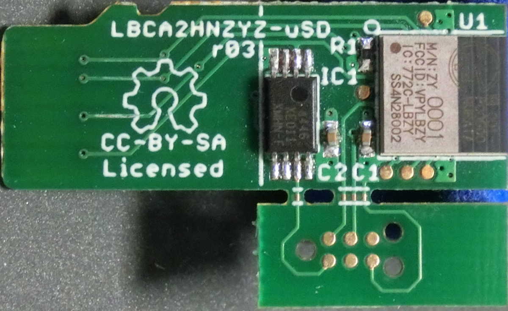
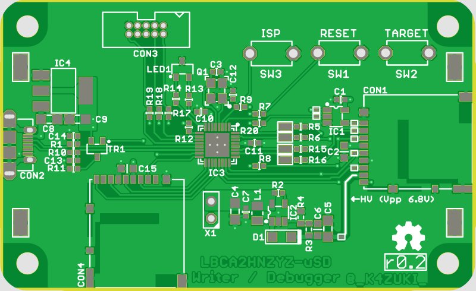

#作ってみた
@sec:Mybestidea で考えたハードウェア・ソフトウェアを実作してみます。

## ハードウェア: 村田モジュール評価ボード（の再発明）
###マイクロSD風モジュール基板
筆者がすでにオープンソースハードウェアとして開発中^[https://github.com/K4zuki/da14580]
の"村田モジュールブレークアウト基板"を使います。村田モジュールのすべてのピンが
ピンヘッダに引き出され、ブレッドボードなどに挿して使えるようになっています。
また、

* 1x リセットピン
* 1x OTP書き込み電圧入力ピン
* 2x SPIフラッシュメモリ([@sec:aboutspiFlash])

がつながっています。
詳細は下記回路図を参照してください。

{width=80%}

{width=80%}

外部ホスト/DA14580/SPIフラッシュメモリの関係を表にしておきます。

Table:接続関係表_TBC_

`Out/SPIconnection_t.md`{.include}

###マザーボード _TBC_
#### 'リビジョン0.1' {.unnumbered}
LPC11U35マイコンとマイクロSDソケットが2個載ったマザーボード的な基板を作ります。
マイクロSDソケットは実際にマイクロSDカードを挿すためのものと、先述の"村田モジュール基板"のためのもので2個載ります。
`リビジョン0.1`はマイクロSDモジュールとの接続部で誤解していたので動かないことがわかりました。
誤解は解けたので`リビジョン0.2`として作り直す予定です。

#### 回路図 {.unnumbered}
`リビジョン0.2`の回路図を示します。

{#MBsch width=80%}

大きく分けると

* USB電源
    * LPC11U35/マイクロSDカード/"村田モジュール基板"用の3.3V電源レギュレータ
* マイクロSDソケット2個
    * マイクロSDカードと村田モジュール基板それぞれ1つずつ
* 書き込み電圧生成回路
    * 村田モジュールのOTPにアプリケーションを焼くときにピンヘッダをショートさせる
* リセット/ISP/ターゲット書込みトリガボタン
    * リセットボタンでLPC11U35をリセット
        * ISPを押しながらリセットするとLPC11U35がファームウェア書込みモードになります
    * ターゲット書込みボタン
* SWD10コネクタ

#### 実装面図 {.unnumbered}
同じく実装面図です。

{#MBbrd width=80%}

#### BOM {.unnumbered}
部品リストです。

`./Out/MurataMicroMB_b.md`{.include}

## ソフトウェア
多くの部分がコピペで済んでいます。先人の努力とその成果に感謝します。

### マイクロSDドライバ _TBC_
### USB CDC/MSC/HIDコンポジットデバイス
このUSBCDC/MSC/HIDコンポジットデバイスファームウェアとそれに付随するマイクロSDカードドライバは、
va009039^[https://developer.mbed.org/users/va009039/]氏の成果によるものです。

### `DA14580`セカンダリブートローダ

```
DA1458X_SDK
  `- 5.0.3
      `- utilities
          `- secondary_bootloader
              |- secondary_bootloader.uvproj
              |- secondary_bootloader.uvopt
              |- secondary_bootloader.uvprojx
              |- secondary_bootloader.uvoptx
              |- out
              |- src
              |   |- bootloader.c (*)
              |   |- crc16.c
              |   |- crc32.c
              |   |- main.c
              |   |- spi_commands.c
              |   |- sw_aes.c
              |   |- timer.c
              |   |- uart.c
              |   `- uart_booter.c
              |- includes
              |   |- bootloader.h (*)
              |   |- os_port.h
              |   |- sw_aes.h
              |   |- uart.h
              |   |- user_periph_setup.h (*)
              |   |- os_int.h
              |   |- spi_commands.h
              |   |- timer.h
              |   `- uart_booter.h (*)
              `- startup
                  |- bootloader.sct (*)
                  |- startup_CMSDK_CM0.s
                  |- sysram.ini (*)
                  `- system_CMSDK.c
```
Dialog社SDK5ソースツリーのセカンダリブートローダサンプルは最初からSPIフラッシュからブートするようになっているのでピン配と`#define`定義をいくつか変更します。

- `bootloader_.ini`
- `bootloader_.sct`
- `user_periph_setup.h`
    - ```{.c}
        #define SPI_GPIO_PORT   GPIO_PORT_0
        #define SPI_CS_PIN      GPIO_PIN_2
        #define SPI_CLK_PIN     GPIO_PIN_6
        #define SPI_DO_PIN      GPIO_PIN_7
        #define SPI_DI_PIN      GPIO_PIN_3
    ```
- `bootloader.h`
    - ```{.c}
    #define AES_ENCRYPTED_IMAGE_SUPPORTED 0
    #define SUPPORT_AN_B_001
    #undef ALLOW_NO_HEADER
    ```
- `uart_booter.h`
    - `#define SYSRAM_COPY_BASE_ADDRESS 0x20000000`
- `bootloader.c`
    - L.221
    - ```{.c}
    SpiFlashRead(SYSRAM_COPY_BASE_ADDRESS, (unsigned long)AN001_SPI_STARTCODE_POSITION,...
                 ^^^^^^^^^^^^^^^^^^^^^^^^
    ```

<!--
+-------------------------------------------------------------------------+
|Listing: "spi\\\_commands.c(抜粋)"                                       |
|```{#lst:spi_commands_c .c}                                              |
|GPIO_ConfigurePin( GPIO_PORT_1, GPIO_PIN_0, OUTPUT, PID_SPI_EN,  true  );|
|GPIO_ConfigurePin( GPIO_PORT_0, GPIO_PIN_5, OUTPUT, PID_SPI_CLK, false );|
|GPIO_ConfigurePin( GPIO_PORT_0, GPIO_PIN_4, OUTPUT, PID_SPI_DO,  false );|
|GPIO_ConfigurePin( GPIO_PORT_0, GPIO_PIN_7, INPUT,  PID_SPI_DI,  false );|
|```                                                                      |
+-------------------------------------------------------------------------+
 -->

ビルドされたファイルを自動的にバイナリに再変換するように設定をいじります。
`Alt + F7` で設定ウィンドウを開き、`User`タブ→`After Build/Rebuild`→`Run #1`にチェック
を入れる→`User Command`欄に以下のとおり書き込みます：

+-------------------------------------------------------------------------------+
|`fromelf --bin --output out/loader.bin out/secondary_bootloader.axf`           |
+-------------------------------------------------------------------------------+

*`--bin`と`--output`はダッシュ記号が2個必要です。1個のままだとコンパイル時に警告が出ます。*

`loader.bin`を固定値配列として
