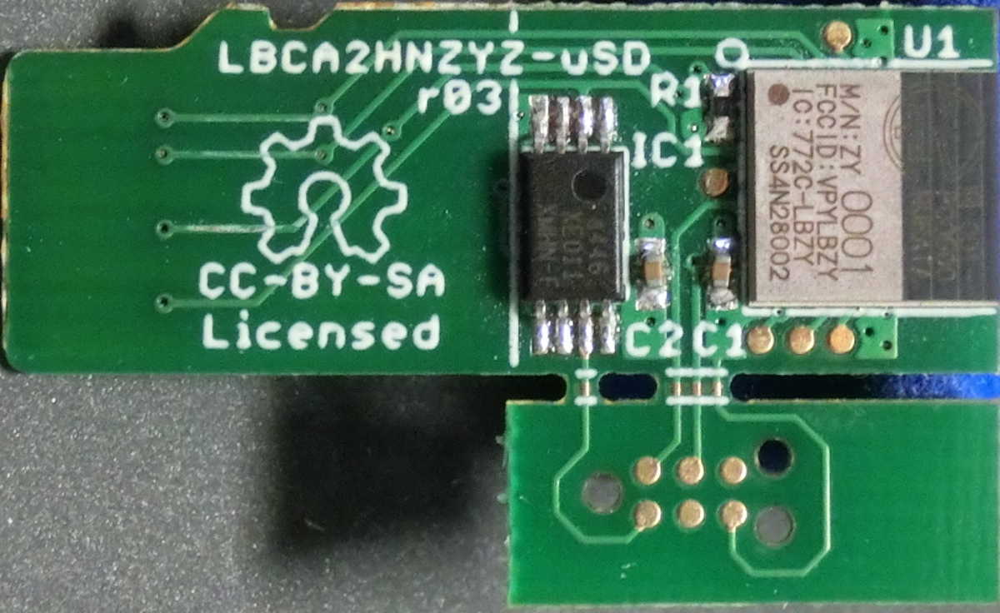
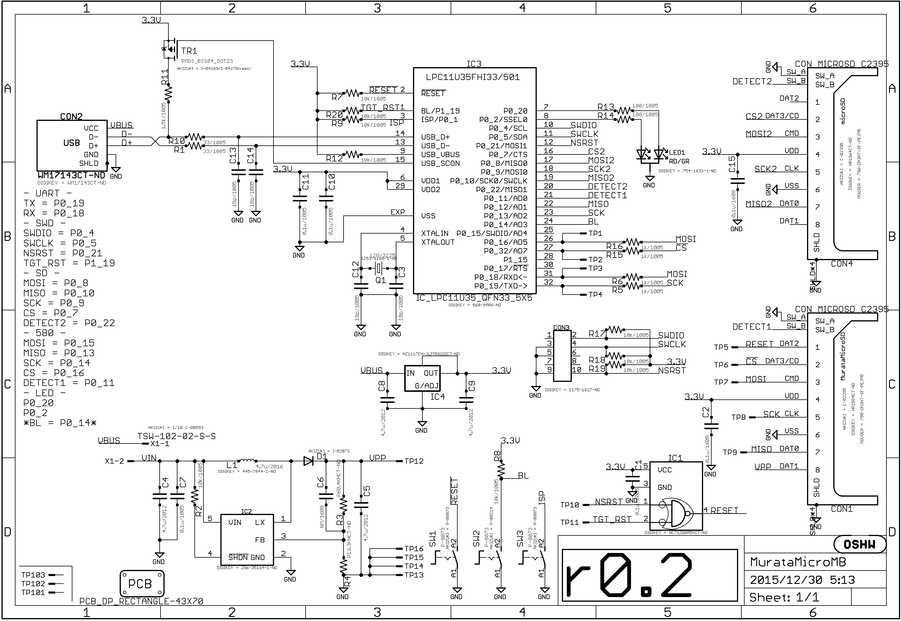
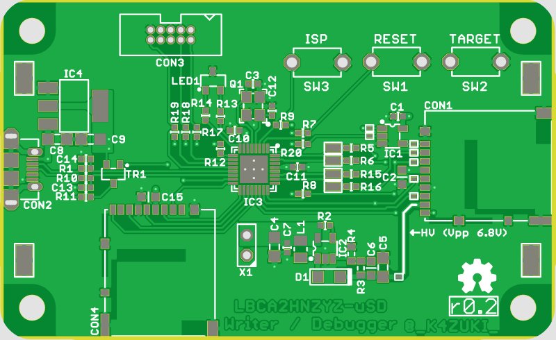

#作ってみた
@sec:Mybestidea で考えたハードウェア・ソフトウェアを実作してみます。

## ハードウェア: 村田モジュール評価ボード（の再発明）
###マイクロSD風モジュール基板
筆者がすでにオープンソースハードウェアとして開発中^[https://github.com/K4zuki/da14580]
の"村田モジュール基板"を使います。
この基板はマイクロSDカードスロットに刺せる形状になっていて、マイクロSDの端子には

* 1x リセットピン
* 1x OTP書き込みピン
* 4x GPIOピン（ホストとの通信またはフラッシュメモリへの書き込み）
* 1x SPIフラッシュメモリ([@sec:aboutspiFlash])

がつながっています。この基板にはSWDデバッグ用の”TagConnect”パッドが用意されています。
詳細は下記回路図を参照してください。

\newpage

{width=80%}

{width=80%}

外部ホスト/DA14580/SPIフラッシュメモリの関係を表にしておきます。

Table:接続関係表

`SPIconnection_t.md`{.include}

###マザーボード
#### 'リビジョン0.1' {.unnumbered}
LPC11U35マイコンとマイクロSDソケットが2個載ったマザーボード的な基板を作ります。
マイクロSDソケットは実際にマイクロSDカードを挿すためのものと、先述の"村田モジュール基板"のためのもので2個載ります。
`リビジョン0.1`はマイクロSDモジュールとの接続部で誤解していたので動かないことがわかりました。
誤解は解けたので`リビジョン0.2`として作り直す予定です。

#### 回路図 {.unnumbered}
`リビジョン0.2`の回路図を示します。

{#MBsch width=80%}

#### 実装面図 {.unnumbered}
同じく実装面図です。

{#MBbrd width=80%}

#### BOM {.unnumbered}
部品リストです。

+-------------------------+------------------------+------------------------+-----+
| AKIZUKI/DIGIKEY         | Reference              | Value                  | Qty |
+=========================+========================+========================+=====+
| **DIGIKEY**             |                        |                        |     |
+-------------------------+------------------------+------------------------+-----+
| 490-3261-1-ND           | C1, C7, C10, C11       | 0.1u/1005              |  4  |
+-------------------------+------------------------+------------------------+-----+
| 490-5858-1-ND           | C3, C12, C13, C14      | 18p/1005               |  4  |
+-------------------------+------------------------+------------------------+-----+
| 490-9962-1-ND           | C4, C5, C8, C9         | 4.7u/2012              |  4  |
+-------------------------+------------------------+------------------------+-----+
| HR1964CT-ND             | CON1, CON4             | CON_MICROSD_C2395      |  2  |
+-------------------------+------------------------+------------------------+-----+
| WM17143CT-ND            | CON2                   | WM17143CT-ND           |  1  |
+-------------------------+------------------------+------------------------+-----+
| 1175-1627-ND            | CON3                   | CORESIGHT10            |  1  |
+-------------------------+------------------------+------------------------+-----+
| SS24FLCT-ND             | D1                     | 40V2A                  |  1  |
+-------------------------+------------------------+------------------------+-----+
| NC7SZ00M5XCT-ND         | IC1                    | SINGLE_74_00           |  1  |
+-------------------------+------------------------+------------------------+-----+
| 296-35164-1-ND          | IC2                    | LM27313                |  1  |
+-------------------------+------------------------+------------------------+-----+
| 568-9586-ND             | IC3                    | IC_LPC11U35_QFN33_5X5  |  1  |
+-------------------------+------------------------+------------------------+-----+
| AZ1117EH-3.3TRG1DICT    |                        |                        |     |
| -ND                     | IC4                    | LDO4_3.3_SOT223        |  1  |
+-------------------------+------------------------+------------------------+-----+
| 445-7844-1-ND           | L1                     | 4.7u/2016              |  1  |
+-------------------------+------------------------+------------------------+-----+
| 754-1633-1-ND           | LED1                   | RD/GR                  |  1  |
+-------------------------+------------------------+------------------------+-----+
| 1253-1168-1-ND          | Q1                     | 12M/3225               |  1  |
+-------------------------+------------------------+------------------------+-----+
| P33.0LCT-ND             | R1, R10                | 33/1005                |  2  |
+-------------------------+------------------------+------------------------+-----+
|                         | R2, R7, R8,\           |                        |     |
|                         | R9, R12, R17,\         |                        |     |
| P10.0KLCT-ND            | R18, R19, R20          | 10k/1005               |  9  |
+-------------------------+------------------------+------------------------+-----+
| P60.4KHCT-ND            | R3                     | P60.4KHCT-ND           |  1  |
+-------------------------+------------------------+------------------------+-----+
| P13.3KHCT-ND            | R4                     | P13.3KHCT-ND           |  1  |
+-------------------------+------------------------+------------------------+-----+
| P1.00KLCT-ND            | R5, R6, R15, R16       | 1k/1005                |  4  |
+-------------------------+------------------------+------------------------+-----+
| P1.50KLCT-ND            | R11                    | 1.5k/1005              |  1  |
+-------------------------+------------------------+------------------------+-----+
| P100LCT-ND              | R13, R14               | 100/1005               |  2  |
+-------------------------+------------------------+------------------------+-----+
| A106145CT-ND            | TP1, TP2, TP3, TP4     | TESTPAD_1608           |  4  |
+-------------------------+------------------------+------------------------+-----+
| 36-5019CT-ND            | TP13, TP14, TP15, TP16 | TESTPAD_4020           |  4  |
+-------------------------+------------------------+------------------------+-----+
| **AKIZUKI**             |                        |                        |     |
+-------------------------+------------------------+------------------------+-----+
| 1/10 C-08593            | X1                     | TSW-102-02-S-S         |  1  |
+-------------------------+------------------------+------------------------+-----+
| I-04269/I-04270(reel)   | TR1                    | BSS84                  |  1  |
+-------------------------+------------------------+------------------------+-----+
| P-05650                 | C2, C15                | 0.1u/1608              |  2  |
+-------------------------+------------------------+------------------------+-----+
| P-08073                 | SW1, SW3               | P-8073                 |  2  |
+-------------------------+------------------------+------------------------+-----+
| P-08214                 | SW2                    | P-8073                 |  1  |
+-------------------------+------------------------+------------------------+-----+
| **NOT_COMPONENT**       |                        |                        |     |
+-------------------------+------------------------+------------------------+-----+
| ICON_OSHW               | U$1                    |                        |  1  |
+-------------------------+------------------------+------------------------+-----+
|                         | TP5, TP6, TP7, TP8\    |                        |     |
| TESTPAD                 | TP9, TP10, TP11, TP12  |                        |  8  |
+-------------------------+------------------------+------------------------+-----+
| TESTPAD_F               | TP101, TP102, TP103    |                        |  3  |
+-------------------------+------------------------+------------------------+-----+
| PCB_DP_RECTANGLE        |                        | PCB_DP_RECTANGLE       |     |
| -43X70                  | PCB1                   | -43X70                 |  1  |
+-------------------------+------------------------+------------------------+-----+
| C_SMD__1608             | C6                     | NM/1608                |  1  |
+-------------------------+------------------------+------------------------+-----+

## ソフトウェア
多くの部分がコピペで済んでいます。先人の努力とその成果に感謝します。

### マイクロSDドライバ
### USB CDC/MSCコンポジットデバイス
このUSBCDC/MSCコンポジットデバイスファームウェアとそれに付随するマイクロSDカードドライバは、
va009039^[https://developer.mbed.org/users/va009039/]氏の成果によるものです。

### `DA14580`セカンダリブートローダ
Dialog社SDK5ソースツリーに若干手を加えるだけでセカンダリブートローダのhexを生成できます。
