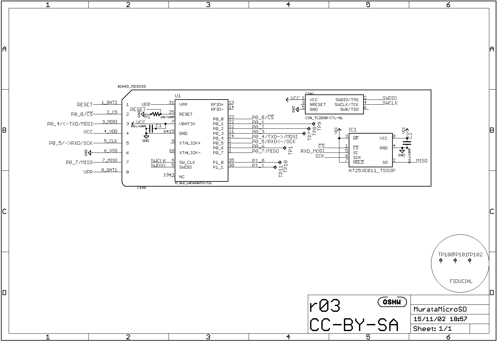

#作ってみた
@sec:Mybestidea で考えたハードウェア・ソフトウェアを実作してみます。

## ハードウェア: 村田モジュール評価ボード（の再発明）
###マイクロSD風モジュール基板
筆者がすでにオープンソースハードウェアとして開発中^[https://github.com/K4zuki/da14580]
の"村田モジュール基板"を使います。
この基板はマイクロSDカードスロットに刺せる形状になっていて、マイクロSDの端子には

* 1x リセットピン
* 1x OTP書き込み電圧入力ピン
* 4x GPIOピン（ホストとの通信またはフラッシュメモリへの書き込み）
* 1x SPIフラッシュメモリ([@sec:aboutspiFlash])

がつながっています。この基板にはSWDデバッグ用の”TagConnect”パッドが用意されています。
詳細は下記回路図を参照してください。

\newpage

{width=80%}

{width=80%}

外部ホスト/DA14580/SPIフラッシュメモリの関係を表にしておきます。

Table:接続関係表

`Out/SPIconnection_t.md`{.include}

###マザーボード
#### 'リビジョン0.1' {.unnumbered}
LPC11U35マイコンとマイクロSDソケットが2個載ったマザーボード的な基板を作ります。
マイクロSDソケットは実際にマイクロSDカードを挿すためのものと、先述の"村田モジュール基板"のためのもので2個載ります。
`リビジョン0.1`はマイクロSDモジュールとの接続部で誤解していたので動かないことがわかりました。
誤解は解けたので`リビジョン0.2`として作り直す予定です。

#### 回路図 {.unnumbered}
`リビジョン0.2`の回路図を示します。

{#MBsch width=80%}

大きく分けると

* USB電源
    * LPC11U35/マイクロSDカード/"村田モジュール基板"用の3.3V電源レギュレータ
* マイクロSDソケット2個
    * マイクロSDカードと村田モジュール基板それぞれ1つずつ
* 書き込み電圧生成回路
    * 村田モジュールのOTPにアプリケーションを焼くときにピンヘッダをショートさせる
* リセット/ISP/ターゲット書込みトリガボタン
    * リセットボタンでLPC11U35をリセット
        * ISPを押しながらリセットするとLPC11U35がファームウェア書込みモードになります
    * ターゲット書込みボタン
* SWD10コネクタ

#### 実装面図 {.unnumbered}
同じく実装面図です。

{#MBbrd width=80%}

#### BOM {.unnumbered}
部品リストです。

`./Out/MurataMicroMB_b.md`{.include}

## ソフトウェア
多くの部分がコピペで済んでいます。先人の努力とその成果に感謝します。

### マイクロSDドライバ
### USB CDC/MSC/HIDコンポジットデバイス
このUSBCDC/MSC/HIDコンポジットデバイスファームウェアとそれに付随するマイクロSDカードドライバは、
va009039^[https://developer.mbed.org/users/va009039/]氏の成果によるものです。

### `DA14580`セカンダリブートローダ
Dialog社SDK5ソースツリーのセカンダリブートローダサンプルは最初からSPIフラッシュからブートするようになっているのでピン配だけ変更します。

<!-- ```{#lst:code .haskell caption="Listing caption"}
main :: IO ()
main = putStrLn "Hello World!"
``` -->

Listing: "spi\\\_commands.c(抜粋)"

```{#lst:spi_commands_c .c .numberLines numbers="left"}
GPIO_ConfigurePin( GPIO_PORT_1, GPIO_PIN_0, OUTPUT, PID_SPI_EN,  true  );
GPIO_ConfigurePin( GPIO_PORT_0, GPIO_PIN_5, OUTPUT, PID_SPI_CLK, false );
GPIO_ConfigurePin( GPIO_PORT_0, GPIO_PIN_4, OUTPUT, PID_SPI_DO,  false );
GPIO_ConfigurePin( GPIO_PORT_0, GPIO_PIN_7, INPUT,  PID_SPI_DI,  false );
```

***
<!-- `patch.diff`{.include} -->

ビルドされたファイルを自動的にバイナリに再変換するように設定をいじります。

+--------------------------------------------------------------+
|`fromelf --bin --output [出力:BINファイル] [入力:ELFバイナリ]`|
+--------------------------------------------------------------+
