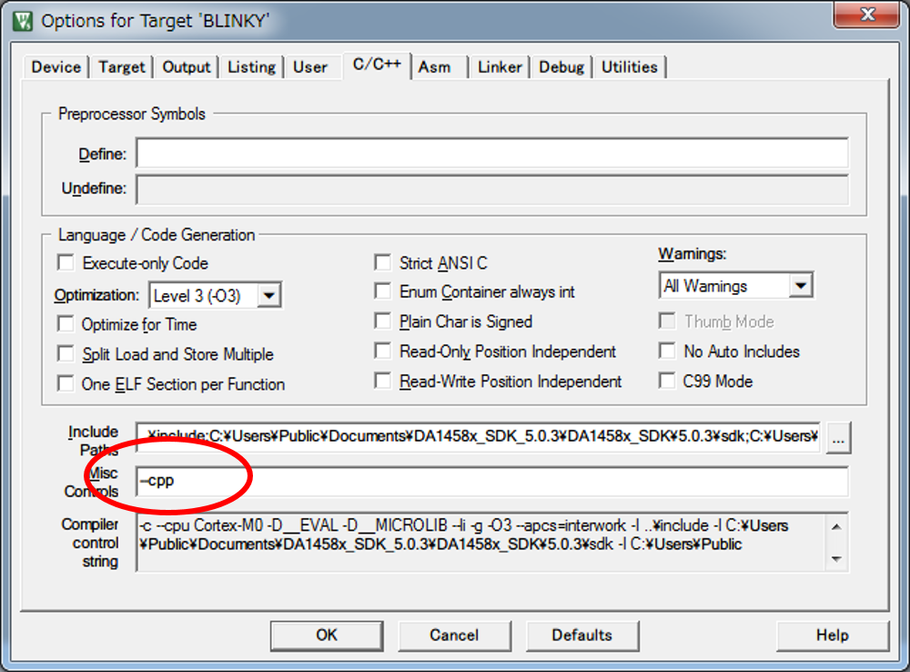
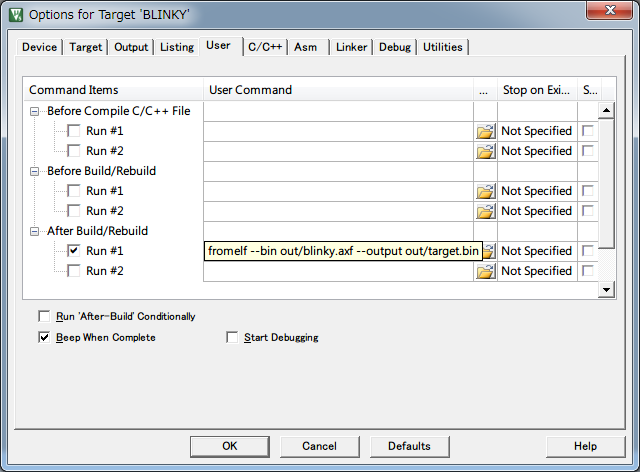
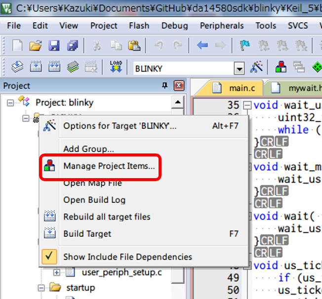
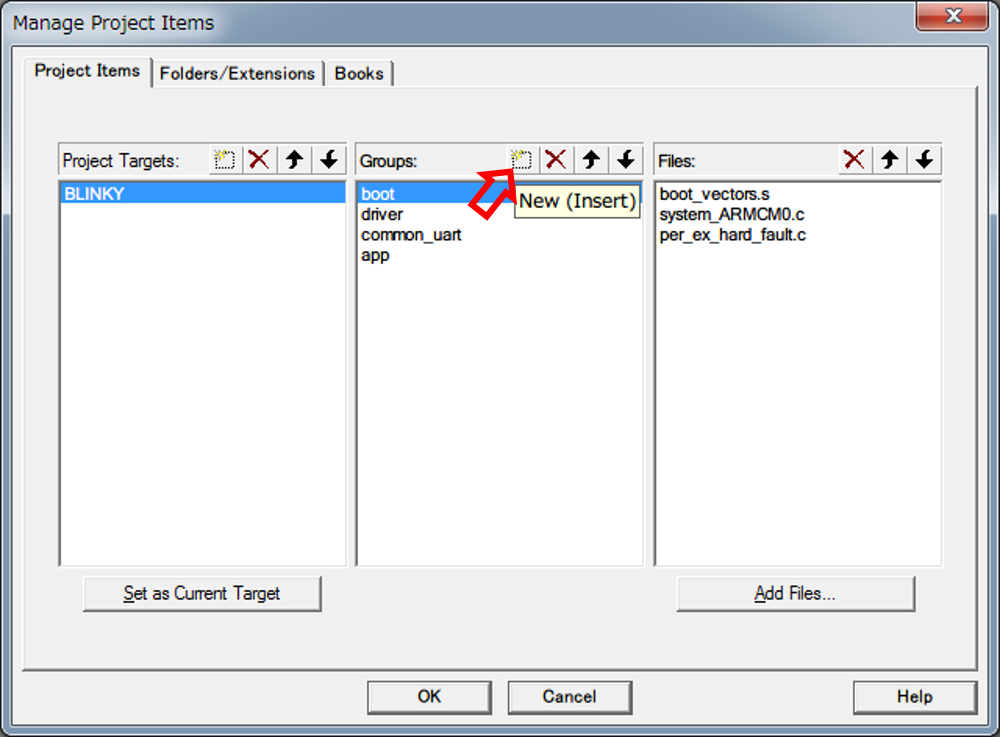
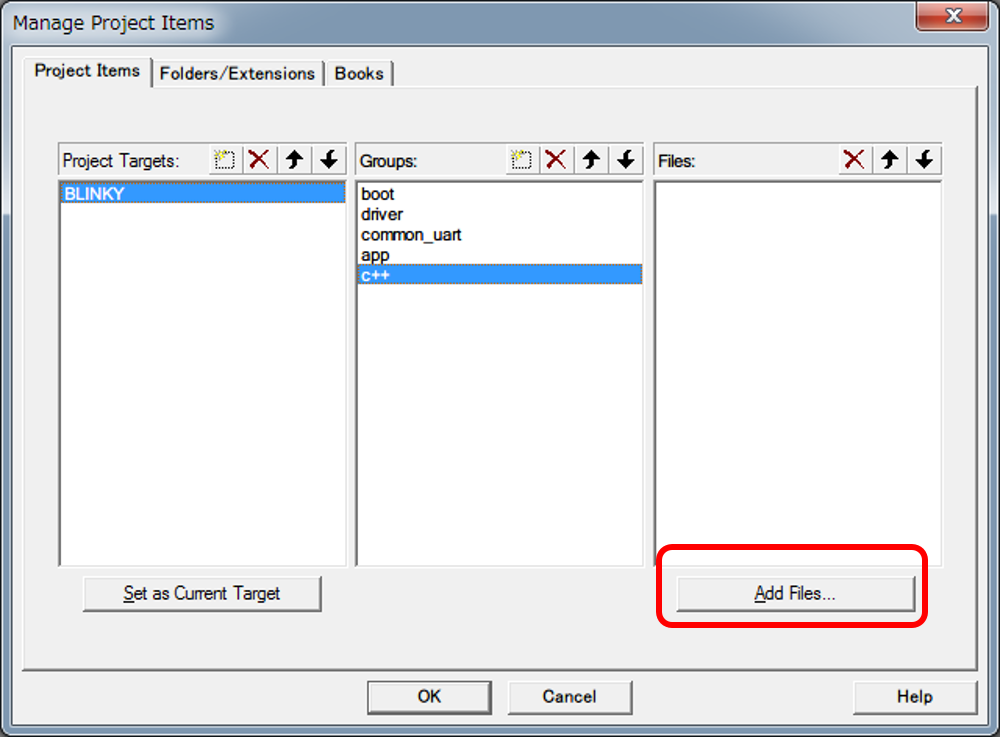
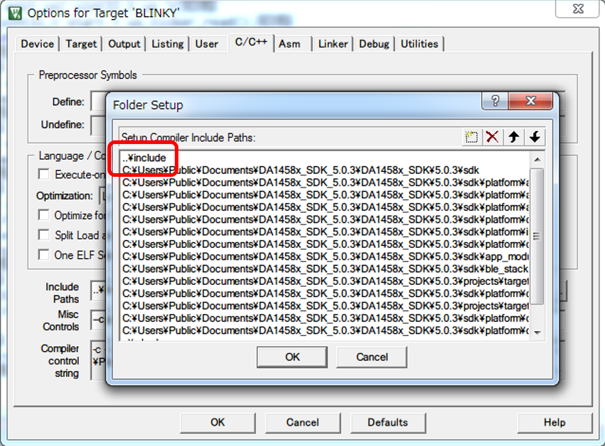

# Lチカ
~~壮大なオチまでもうちょっとだがんばれ~~

## 既存プロジェクトを叩き台にする
~~もう夏コミ間近だやばい~~ SDK内にあるblinkyプロジェクトを叩き台にします。
そのままピン配置の設定だけ変えれば正直動きますが、あえていじります。

Listing: SDKディレクトリツリー

```{#lst:sdkdirtree}
|- DA1458x_SDK_5.0.3/
.   `- DA1458x_SDK/
.       `- 5.0.3/
.           |- license.txt
.           |- binaries/
.           |- projects/
.           |   |- adc
.           |   |- i2c
.           |   |- shared
.           |   |- systick
.           |   |- timer2
.           |   |- uart2_async
.           |   |- blinky(＊)
.           |   |- quadrature_decoder
.           |   |- spi
.           |   `- timer0
.           |- sdk/
.           `- utilities/
```
\newpage
Listing: プロジェクトディレクトリツリー（最終形）

```{#lst:projectdirtree}
blinky
  |- Keil_4
  |   |- blinky.uvopt  
  |   `- blinky.uvproj
  |- Keil_5
  |   |- blinky.uvoptx  
  |   |- blinky.uvprojx  
  |   `- out/
  |       `- target.bin
  |- c++
  |   |- mygpio.cpp  
  |   |- myserial.cpp  
  |   `- mywait.cpp
  |- include
  |   |- mygpio.h  
  |   |- myserial.h  
  |   |- mywait.h  
  |   |- pin_names.h  
  |   `- user_periph_setup.h
  `- src
      |- main.c  
      `- user_periph_setup.c
```

## プロジェクトファイルの改造
デフォルトのままだとインクルードパスが相対パスだったり、ソースファイルのグループ
を追加する必要があったり、コンパイルオプションが不足しているので改造します。

\newpage
### Miscコンパイルオプション書換え
元のプロジェクトファイルはC言語での開発を前提に考えられていますが、一方で
mbedライブラリはC++言語の実装です。C++向けのライブラリを流用するため、
Keil5用のプロジェクトファイルを開き、コンパイル"Misc"オプションを`--cpp`
に書き換えます。



\newpage
### ファイルコンバータコマンド追記
出力ファイルの形式を単一バイナリに変換します。コンパイル後に実行する
ユーザコマンドを指定します。

+-------------------------------------------------------------------------------+
|_`--bin`と`--output`はダッシュ記号が2個必要です。1個のままだとコンパイル時に\  |
|警告が出ます。_                                                                |
+-------------------------------------------------------------------------------+



\newpage
### プロジェクトファイルの管理
プロジェクトで使われるファイルの管理画面を開きます。



\newpage
#### グループの追加{-}
新規グループを追加します（例えば`c++`）。



\newpage
#### グループにファイルを追加する{-}
追加したグループにC++用ファイルを全部追加します。ヘッダファイルは別途検索パスに
追加しないと見つけられずエラーになります。



\newpage
### インクルードパスにディレクトリを追加する？
元から`blinky/include`が追加されてるので今回は不要ですが、必要なら追加します。



\newpage
## mbedライブラリの移植
### `PinName` / `DigiralIn` / `DigitalOut` / `DigitalInOut`
mbed開発環境では、ターゲットマイクロコントローラのIOピンに`P0_1`や`P1_10`などの
名前を使ってアクセスできるようになっています(`PinName`型)。一方現行のDialog社
SDKはマクロと関数を使ってレジスタにアクセスします。mbed SDKに使われているものと
同名の`pin_names.h`を用意し、定義済マクロ`GPIO_PORT_0`や`GPIO_PIN_0`を使って
`PinName`列挙型を定義します。[@lst:pin_names_h] に全文を置いてあります。

Listing: pin\\\_names.h(抜粋)

```{#lst:pin_names_h_part .cpp .numberLines numbers="left"}
typedef enum {
    P0_0 = (GPIO_PORT_0 << 8) | (GPIO_PIN_0),
    P0_1 = (GPIO_PORT_0 << 8) | (GPIO_PIN_1),
    P0_2 = (GPIO_PORT_0 << 8) | (GPIO_PIN_2),
    P0_3 = (GPIO_PORT_0 << 8) | (GPIO_PIN_3),
    .
    .
    .
    P3_4 = (GPIO_PORT_3 << 8) | (GPIO_PIN_4),
    P3_5 = (GPIO_PORT_3 << 8) | (GPIO_PIN_5),
    P3_6 = (GPIO_PORT_3 << 8) | (GPIO_PIN_6),
    P3_7 = (GPIO_PORT_3 << 8) | (GPIO_PIN_7),
} PinName;
```

いずれかのターゲット向けのmbed_blinkyプロジェクトをオフラインコンパイラ用に
エクスポートし、ヘッダやCソースの内容を~~パクr~~_**大いに参考にして**_
`DigitalIn`/`DigitalOut`クラスを定義します。PinNameを分解して
`GPIO_ConfigurePin()`関数や`GPIO_GetPinStatus()`関数にピン情報を渡します。

```{.cpp}
void GPIO_ConfigurePin( GPIO_PORT port, GPIO_PIN pin, GPIO_PUPD mode,
                          GPIO_FUNCTION function, const bool high )
```

Listing: mygpio.cpp(抜粋)

```{#lst:mygpio_cpp_part .cpp .numberLines numbers="left"}
DigitalOut::DigitalOut(PinName pin){
    _port = (GPIO_PORT)(pin >> 8);
    _pin = (GPIO_PIN)(pin & 0xFF);
    GPIO_ConfigurePin(_port, _pin, OUTPUT, PID_GPIO, false);
}
    .
    .
    .

void DigitalOut::write(int value){
    GPIO_ConfigurePin(_port, _pin, OUTPUT, PID_GPIO, value? 1 : 0);
}

int DigitalOut::read(){
    return GPIO_GetPinStatus(_port, _pin);
}
    .
    .
    .
```

オペレータ実装はヘッダファイルに記述します（全文は[@lst:mygpio_h]）。

Listing: mygpio.h(抜粋)

```{#lst:mygpio_h_part .cpp .numberLines numbers="left"}
    DigitalOut & operator= (int value){
        write(value);
        return *this;
    }

    operator int(){
        return read();
    }
```
### `Serial`
mbedライブラリで継承しているStreamクラスも用意しなければならないのですが、
そこまでするとライブラリが肥大化するため諦めました。
したがってこの`Serial`クラスは極めて限定的なことしかできません。
宣言時にピンを指定できることと
`format()`と`baud()`でビット長・パリティ・ストップビット・
ボーレート^[このボーレート設定の仕様は控えめに言ってひどいです。
16MHzのメインクロックを16分周したもの(つまり1.0MHz)をレジスタ設定値で
分周してボーレートにしてます。精度悪いです。]
を設定できるのみで、残りは何も手がついてない状態です。
独自の`printf_string()`関数が用意されているので、`sprintf()`などをつかって
`printf()`の代わりに使うか、１から自力で実装するのがいいかもしれません。

<!--
Listing: myserial.cpp(抜粋)
```{#lst:myserial_cpp_part .cpp .numberLines numbers="left"}
void Serial::format(int bits = 8, Parity parity = None,
                                    int stop_bits = 1){
    _mode = 0;

    switch(bits){
        case 5:{  _mode  |= 0x00; break; }
        case 6:{  _mode  |= 0x01; break; }
        case 7:{  _mode  |= 0x02; break; }
        case 8:{  _mode  |= 0x03; break; }
        default:{ _mode  |= 0x03; break; }
    }
    .
    .
    .
    // ACCESS DIVISORLATCH REGISTER FOR BAUDRATE 115200, REGISTER
    //UART_DLH/DLL_REG IF UART2_LCR_REG.DLAB=1
    SetBits16(UART2_LCR_REG, UART_DLAB, 1);

    // NO PARITY, 1 STOP BIT, 8 DATA LENGTH AND
    SetWord16(UART2_LCR_REG, _mode);

    //ENABLE TX INTERRUPTS, REGISTER IER IF UART2_LCR_REG.DLAB=0
    SetBits16(UART2_LCR_REG, UART_DLAB, 0);
}

void Serial::baud(int baudrate){
    _baudr = 0;
    _baudrate = baudrate;
    switch(_baudrate){
        case 115200:{ _baudr = UART_BAUDRATE_115K2;  break; }
        case 57600:{  _baudr = UART_BAUDRATE_57K6;   break; }
        case 38400:{  _baudr = UART_BAUDRATE_38K4;   break; }
        case 28800:{  _baudr = UART_BAUDRATE_28K8;   break; }
        case 19200:{  _baudr = UART_BAUDRATE_19K2;   break; }
        case 9600:{   _baudr = UART_BAUDRATE_9K6;    break; }
        case 2400:{   _baudr = UART_BAUDRATE_2K4;    break; }
        // default:{     _baudr = 400;   break; }
        default:{     _baudr = UART_BAUDRATE_57K6;   break; }
    }

    // ACCESS DIVISORLATCH REGISTER FOR BAUDRATE 115200, REGISTER
    // UART_DLH/DLL_REG IF UART2_LCR_REG.DLAB=1
    SetBits16(UART2_LCR_REG, UART_DLAB, 1);
    SetWord16(UART2_IER_DLH_REG,0); // for serial clk 16MHz baudrate 115200
    SetWord16(UART2_IER_DLH_REG, ( ( _baudr & 0xFF00 ) >> 8 ) );

    // set baudrate ~115200  = serial_clk/(16 * n)
    SetWord16(UART2_RBR_THR_DLL_REG, (uint16_t)(_baudr & 0xFF));

    //ENABLE TX INTERRUPTS, REGISTER IER IF UART2_LCR_REG.DLAB=0
    SetBits16(UART2_LCR_REG, UART_DLAB, 0);
}

```
 -->
### `wait / wait_ms / wait_us`
時間待ち(wait系)関数群はSysTickを動作させ、その読出値の差分から$\mu$秒単位を計測します。
SDK内にSysTick操作関数が用意されているので、wait系関数の実装は楽ができます。

### `main.c`
GPIO, Serial, waitが準備できたので、これらのクラスライブラリをプロジェクトに登録し、
`#include`でインポートします。ここまで来てようやくいつものｴｪｪｪｪﾝﾍﾞｯﾄﾞ!な記述で
楽ができます。

ただし、普通の（公式の）mbedと異なることがいくつかあり、同ファイル内の`system_init()`
は常にmain()の先頭で呼び出される必要があります。

Listing: main.c（抜粋）

```{#lst:main_c_part .cpp .numberLines numbers="left"}
#include <stdio.h>

#include "global_io.h"
#include "common_uart.h"
#include "gpio.h"
#include "mygpio.h"
#include "mywait.h"

void system_init(void);

Serial pc(P0_0, P0_1);
DigitalOut LED(P1_0);
int main (void)
{
    system_init();
    pc.baud(57600); // 57600baudならなんとかなる精度と速度なのでおすすめ
    while(1){
        LED = 1;
        wait_ms(500);
        LED = 0;
        wait_ms(500);
    }
}
```

## コ ン パ イ ル と 実 行
### コンパイル
MDK上でF7を押すとコンパイルされます。Keil_5/out/target.binが生成されるはずです。

### ドラッグ&ドロップ
@sec:load11u35firm でUSBメモリに見えるようになったLPC11U35マイコンに
ドラッグ&ドロップでtarget.binをコピーします。この本の内容のままだと
バイナリサイズは5KB程度しかないはずなので、以前のファイルを消す必要はありません。

### ボタン押して転送されてLED光る
TARGETボタンを押すとUARTブートが行われ、青LEDが点滅すれば成功です。
UARTブート中は赤と緑も点滅すると思います。赤が点滅し続ける場合はなにかおかしいので
状況をGitHubページかmbedのリポジトリページ[^11u35_usbLocalFilesystem] で
報告していただけると、なにか反応があるかもしれません。
<!--
\newpage

+---------------------------------------------------------------------+
| これ以降は章のタイトルを残しておきますが、C90に間に合わないぽいので |
|割愛します。ごめんなさい                                             |
+---------------------------------------------------------------------+

### `SPI`
### `W25X40BV`（SPI フラッシュメモリドライバ）
### `AkiSpiLcd`（秋月的メモリ液晶ドライバ）
 -->
